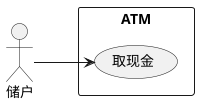
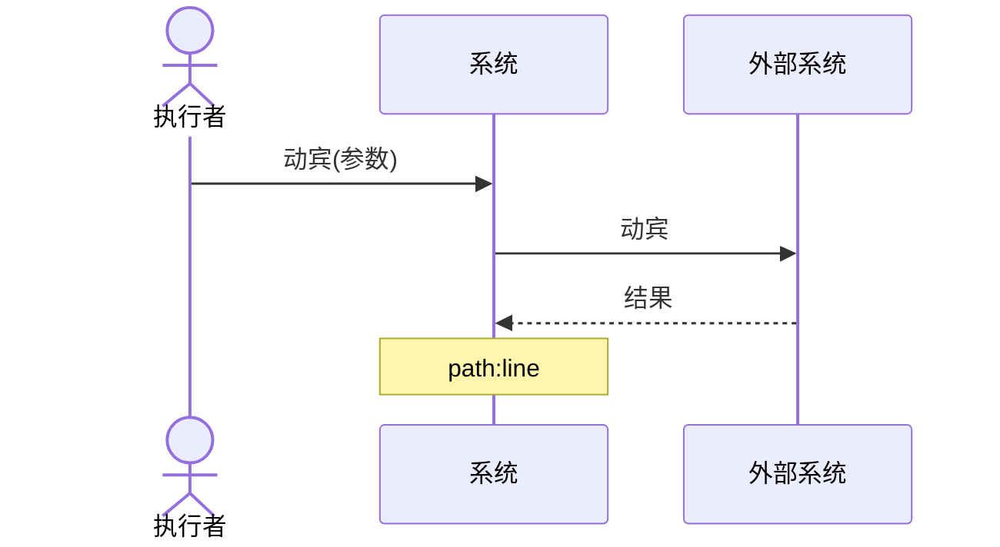
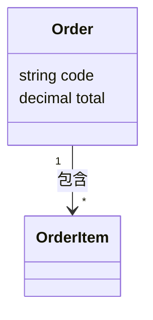
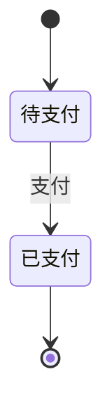
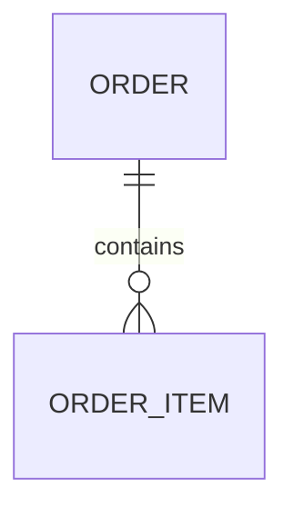
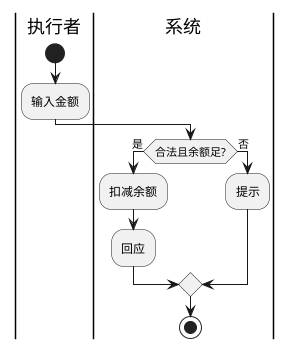

# 图法速查 (diagram-syntax)

工具分工：**Mermaid** 画类图 / 序列图 / 状态机 / ER；**PlantUML** 画用例图（Mermaid 无原生 usecase；PlantUML 是 AI 生成 UML 的缺省表示）+ 用例规约的活动图视图。**语义规则见 `method-abcd.md`**；本文件只给语法模板与风格。

## 选型表

| 图 | 工具 | 后缀 |
|---|---|---|
| 业务用例图 / 系统用例图 | PlantUML | `.puml` |
| 业务序列图 / 系统序列图 | Mermaid `sequenceDiagram` | `.mmd` |
| 设计序列图（对象/方法级） | Mermaid `sequenceDiagram` | `.design.mmd` |
| 类图 / 领域模型 | Mermaid `classDiagram` | `.mmd` |
| 状态机 | Mermaid `stateDiagram-v2` | `.mmd` |
| ER | Mermaid `erDiagram` | `.mmd` |
| 用例规约活动图（视图） | PlantUML activity | `.activity.puml` |
| 架构图 | Mermaid `architecture-beta` / C4 | `.mmd` |

## 模板

### 用例图（PlantUML）

### 序列图（Mermaid）

- **业务序列图**：消息=责任、不写"请求"、不画返回、系统黑箱（method-abcd §2）。
- **系统序列图（逆向设计级）**：泳道 = 本系统 + 外部系统/服务；消息 = 服务间调用，可画返回；`Note` 挂 `文件:行`。
- **设计序列图（逆向设计级 · 对象/方法级）**：泳道 = 系统内部代码模块/类，消息 = 真实方法调用 `mod.method(args)`，可画返回（`-->>`）；`opt`/`alt`/`loop` 表分支，幂等/守门/异常分支用 `Note`；`Note` 挂 `文件:行`；文件 `<flow>.design.mmd`、`type=design-sequence`。它把系统序列图里的"系统"盒子拆成内部对象协作。

### 类图（Mermaid）

语义 / linter 见 method-abcd §3：只 泛化/关联/依赖；聚合空心◇ / 组合实心◆、菱形端=整体；默认普通关联；多重性只 `1`/`*`；类名单数名词。

### 状态机（Mermaid）

### ER（Mermaid）

### 活动图（PlantUML，用例规约路径视图）

## 风格
- 标签用核心域术语、动宾；sentence case；少装饰。
- 逆向序列图用 `Note` 挂 `文件:行`（追溯）。
- 一张图只表达一个视角；跨图一致性靠 `manifest`（元模型层），别让各图自漂。
