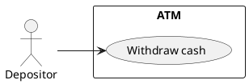
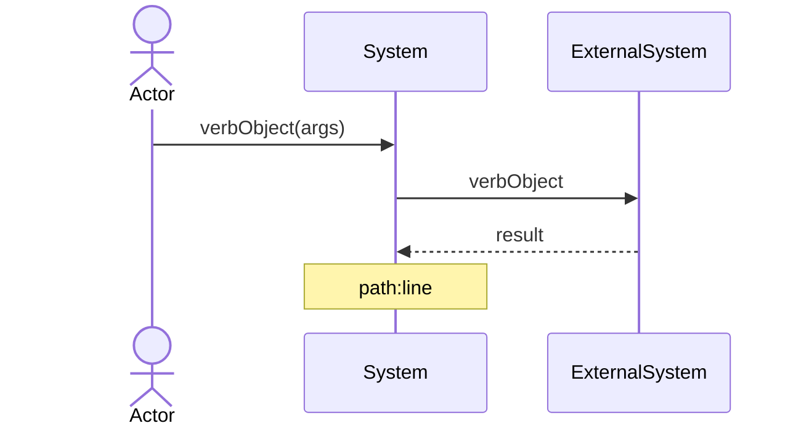
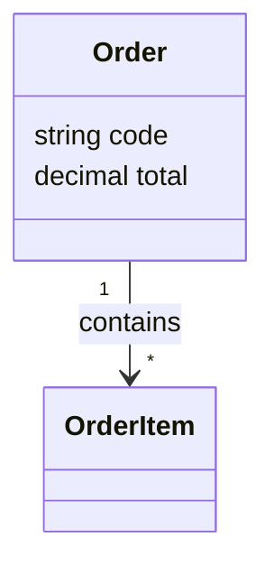
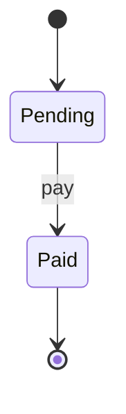
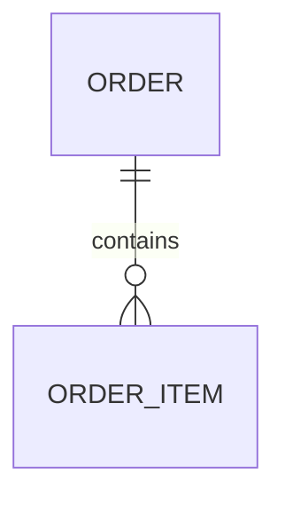
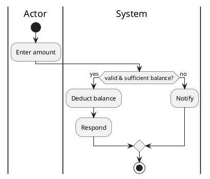

# diagram syntax reference (diagram-syntax)

Tool split: **Mermaid** for class / sequence / state / ER; **PlantUML** for use-case diagrams (Mermaid has no native usecase; PlantUML is the default representation AI generates UML in) + the activity-diagram view of a use-case spec. **Semantic rules live in `method-abcd.md`**; this file is only syntax templates and style.

## Picking a tool

| Diagram | Tool | Suffix |
|---|---|---|
| Business / system use-case diagram | PlantUML | `.puml` |
| Business / system sequence diagram | Mermaid `sequenceDiagram` | `.mmd` |
| Design sequence diagram (object/method level) | Mermaid `sequenceDiagram` | `.design.mmd` |
| Class diagram / domain model | Mermaid `classDiagram` | `.mmd` |
| Distilled OO class diagram (with operations) | Mermaid `classDiagram` | `.oo.mmd` |
| Data model (entities / FKs) | Mermaid `classDiagram` / `erDiagram` | `.mmd` |
| State machine | Mermaid `stateDiagram-v2` | `.mmd` |
| ER | Mermaid `erDiagram` | `.mmd` |
| Use-case-spec activity diagram (view) | PlantUML activity | `.activity.puml` |
| Architecture | Mermaid `architecture-beta` / C4 | `.mmd` |

## Templates

### Use-case diagram (PlantUML)

### Sequence diagram (Mermaid)

- **Business sequence diagram**: message = responsibility, never write "request", never draw returns, system is a black box (method-abcd §2).
- **System sequence diagram (reverse, design-level)**: lifelines = this system + external systems/services; messages = service calls, returns allowed; hang `file:line` in a `Note`.
- **Design sequence diagram (reverse, design-level · object/method level)**: lifelines = internal code modules/classes; messages = real method calls `mod.method(args)`, returns allowed (`-->>`); branch with `opt`/`alt`/`loop`, mark idempotency/guard/exception branches with `Note`; hang `file:line` in `Note`; file `<flow>.design.mmd`, `type=design-sequence`. It opens the "system" box of the system sequence into internal object collaboration.

### Class diagram (Mermaid)

Semantics / linter: see method-abcd §4 — only generalization/association/dependency; aggregation hollow ◇ / composition filled ◆, diamond end = the whole; default plain association; multiplicity only `1`/`*`; class names are singular nouns.
- **Distilled OO class diagram** (reverse): classes carry **operations** `+method()` + attributes; mark boundary classes `<<boundary>>`; note distilled operations with `✦` (they come from free functions). Distillation recipe: method-abcd §4 "Information Expert".

### State machine (Mermaid)

### ER (Mermaid)

### Activity diagram (PlantUML, use-case-spec path view)

## Style
- Labels use core-domain terms, verb-object; sentence case; minimal decoration.
- Reverse sequence diagrams hang `file:line` in a `Note` (traceability).
- One diagram expresses one viewpoint; cross-diagram consistency lives in `manifest` (the metamodel layer) — don't let diagrams drift apart.
